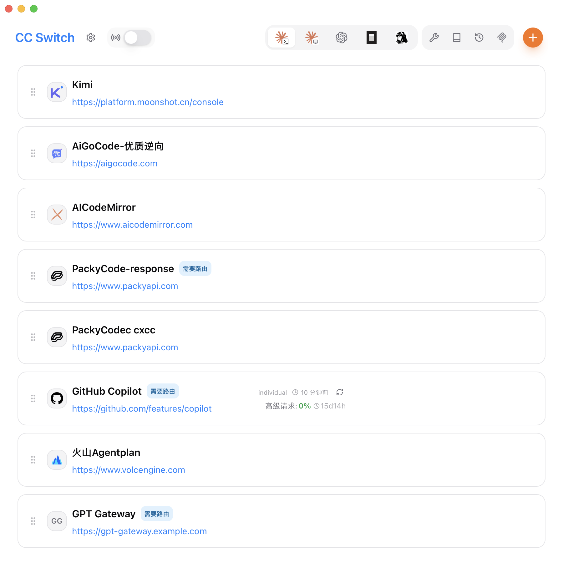
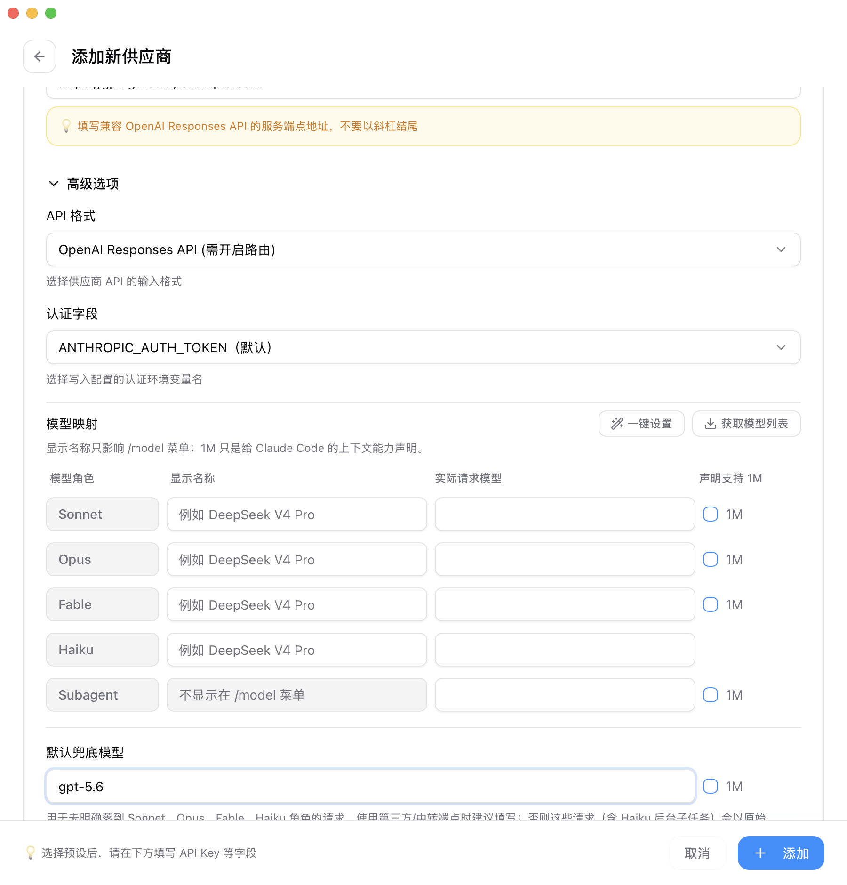
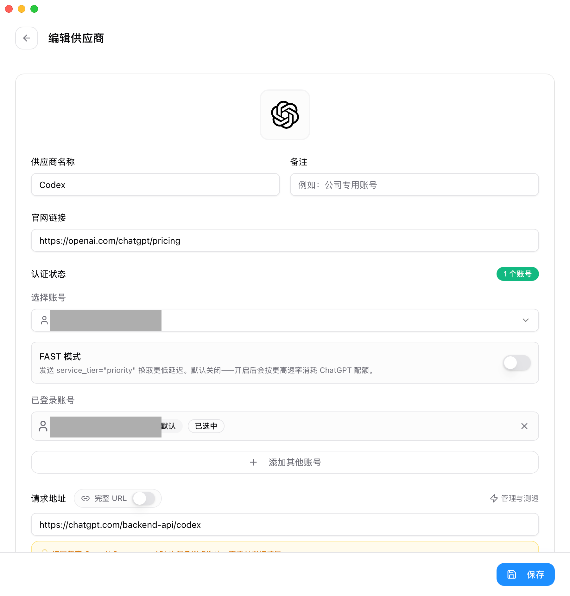

# 通过 CC Switch 在 Claude Code 中使用 GPT 模型

> 适用版本：CC Switch 3.17.0 及以上（更早版本已具备本文两种接入方式，但 gpt-5.6 预设与客户端身份修复自 3.17.0 落地，低版本请求 `gpt-5.6-luna` 这类新模型会误报 404）。本文根据仓库内文档与代码整理，示例数据均已去敏。

## 为什么需要本地路由

Claude Code 面向的是 Anthropic Messages 协议，也就是 `/v1/messages`；而 Codex 系模型的上游——无论是第三方网关暴露的 OpenAI Responses API，还是 ChatGPT 订阅背后的 Codex 服务——说的都是 Responses 协议。两种协议的请求体、流式事件和返回结构完全不同，把这类地址直接填进 Claude Code 的配置里，上游收到的是它不认识的 `/v1/messages` 请求，结果只能是失败。

CC Switch 的做法是让 Claude Code 始终连本机路由，仍以 Anthropic Messages 发送请求；路由识别当前供应商是 Responses 格式后，把请求转换成 Responses 发给上游，再把响应转换回 Messages 形态返回给 Claude Code——工具调用、图片、PDF、思考配置都在转换范围内。

对应两种接入方式，本文都会覆盖：

- **方式一（API Key）**：你手里有某个兼容 OpenAI Responses API 的网关端点和 Key，想在 Claude Code 里跑它背后的 GPT 系模型。
- **方式二（ChatGPT 订阅）**：你有 ChatGPT Plus/Pro 订阅，通过 Codex OAuth 登录直接使用订阅额度，全程不需要 API Key。

这条链路主要分成四步：

1. 接管 Claude Code 后，`~/.claude/settings.json` 里的 `ANTHROPIC_BASE_URL` 会被写成本机路由地址（默认 `http://127.0.0.1:15721`），认证项只留占位符，真实凭据不进 live 配置。
2. 供应商的 `API 格式` 设为 OpenAI Responses，告诉路由：真实上游说的是 Responses 协议。
3. 路由把 `/v1/messages` 请求转换成 Responses 请求体发给上游；方式二还会带上 OAuth token 与官方客户端身份访问 ChatGPT 的 Codex 服务。
4. 上游返回后，路由再把 Responses 的 JSON/SSE 转回 Claude Code 能理解的 Messages 形态。

## 准备工作

- 已安装并能启动的 CC Switch（3.17.0 及以上，原因见开头的版本说明）。
- 已安装 Claude Code，并至少运行过一次。
- 方式一需要：一个兼容 OpenAI Responses API 的服务端点和对应的 API Key，端点地址与模型名以网关文档为准。注意是 **Responses API**，不是 Chat Completions；网关只提供 Chat 格式时也能走通，见第一步「API 格式」处的说明。
- 方式二需要：一个 ChatGPT Plus/Pro 订阅账号。

## 第一步：添加供应商

### 方式一：第三方 Responses 网关（API Key）

打开 CC Switch，切到顶部的 `Claude Code` 标签，点击右上角加号添加供应商，保持默认的 `自定义配置`，然后填写：

- **供应商名称**：随意，例如 `GPT Gateway`。
- **API Key**：你的网关 Key。真实 Key 只保存在 CC Switch 里，由本地路由转发时注入。
- **请求地址**：填网关服务根地址即可，例如 `https://gpt-gateway.example.com`，不要以斜杠结尾，路由会自动把请求打到该网关的 Responses 端点（`/v1/responses`）。网关路径特殊时，打开旁边的 `完整 URL` 开关原样粘贴完整端点。

然后展开 `高级选项`：

- **API 格式**：从默认的 `Anthropic Messages (原生)` 改成 **`OpenAI Responses API (需开启路由)`**。如果网关只提供 Chat Completions 协议，这里改选 `OpenAI Chat Completions (需开启路由)`，其余步骤完全相同。
- **认证字段**：保持默认的 `ANTHROPIC_AUTH_TOKEN（默认）`，路由会以 `Authorization: Bearer <key>` 发给上游——这正是 OpenAI 兼容网关期望的认证头。除非网关文档明确要求 `x-api-key`，否则不要改成 `ANTHROPIC_API_KEY`，改错的典型表现是 401/403。
- **模型映射**：把 Claude Code 的模型角色映射到网关认识的真实模型。**至少要填 `默认兜底模型`**（例如 `gpt-5.6`，以网关文档为准）——留空时未匹配的请求会以原始 Claude 模型名透传给上游而报错，未单独配置的角色则会回落到它。更精细的做法是按行指定：`Sonnet`/`Opus` 填主力模型，`Haiku` 填一个便宜快速的模型（Claude Code 的后台小任务走这一档）。`显示名称` 只影响 `/model` 菜单里的展示，留空则直接显示真实模型名。
- **声明支持 1M**：模型映射每行的 `1M` 复选框会向 Claude Code 声明该档支持 1M 上下文。仅当网关确实以 100 万 token 及以上的窗口服务该模型时才勾选（例如按 API 规格提供 gpt-5.6 的网关），否则长对话会在上游真实上限处直接报错。

保存后，卡片上会出现 `需要路由` 标记——这类供应商必须在本地路由运行时才能正常工作。

### 方式二：ChatGPT 订阅（Codex OAuth）

同样在 `Claude Code` 标签点加号，在预设列表里选择带 OpenAI 图标的 **`Codex`** 预设——它出现在 Claude Code 标签下没有选错，这个预设就是为「在 Claude Code 里用 ChatGPT 订阅」准备的：

- **不需要 API Key，也不需要填地址**——请求固定发往 ChatGPT 的 Codex 服务，表单里的地址项无需改动。
- 点击 **`使用 ChatGPT 登录`**。这是设备码流程：CC Switch 会自动打开浏览器并把验证码复制到剪贴板，在浏览器页面粘贴验证码完成授权即可，期间应用内显示 `等待授权中...`。
- 登录成功后，`认证状态` 显示已登录账号（邮箱）。支持多账号：可 `添加其他账号`、`设为默认`，或在这个供应商上指定使用某个账号；日常管理也可以走 `设置` → `OAuth 认证中心`。
- **FAST 模式**：可选开关，开启后请求携带 `service_tier="priority"` 换取更低延迟，但会按更高速率消耗 ChatGPT 配额，默认保持关闭。
- 模型档位已预填好：`Sonnet`/`Opus` 对应 `gpt-5.6`，`Haiku` 对应 `gpt-5.6-luna`（后台小任务走它，更快更省额度）。

登录凭据保存在 `~/.cc-switch/codex_oauth_auth.json`（不是 `~/.codex/`），与 Codex CLI 自己的登录互不影响；token 会在到期前自动刷新。

## 第二步：开启本地路由并接管 Claude Code

进入设置里的 `路由` 页面，展开 `本地路由`，完成两个开关：

1. 打开 `路由总开关`，启动本地服务（首次开启会弹出说明确认框）。默认地址是 `127.0.0.1:15721`。
2. 在 `路由启用` 中打开 `Claude Code`。只想让 Claude Code 走路由的话，其余应用保持关闭。

接管后，CC Switch 会把 Claude Code 的 live 配置指向本机路由，认证项只有占位符；方式一的网关 Key 和方式二的 OAuth token 都由本地路由在转发时注入。

> **注意**：live 配置是 Claude Code 进程启动时读取的。首次开启接管（或关闭接管恢复直连）后，如果 Claude Code 正在运行，请重开一个终端会话。之后在路由模式下切换供应商就是热切换，无需再重启。

## 第三步：切换供应商并验证

回到 Claude Code 供应商列表，点击目标供应商的 `启用`。如果路由没有在运行，CC Switch 会提示「此供应商使用 OpenAI Responses 接口格式，需要路由服务才能正常使用，请先启动路由」——这个提示不会拦截切换，但路由未开时请求必然失败，回到第二步打开即可。

进入 Claude Code 后可以逐级验证：

- 新开会话，用 `/model` 查看模型菜单：各档显示的是模型映射里的显示名称（方式二默认即 `gpt-5.6`、`gpt-5.6-luna`）。界面个别位置仍可能出现 Claude 系的模型字样——那是路由接管使用的内部角色别名，属正常现象，以 `/model` 菜单和用量看板为准。
- 发一个小问题，观察设置 → 路由页面的「当前 Provider」变成你的供应商、「总请求数」开始增长。
- 用量看板里，这些请求会按上游真实模型显示：映射到 `gpt-5.6` 的档位解析为 Sol 档、显示为 `GPT-5.6 Sol`，`gpt-5.6-luna` 显示为 `GPT-5.6 Luna`，可按供应商筛选核对 token 用量。
- 方式二的供应商卡片还会显示订阅额度：5 小时与 7 天窗口的利用率和重置倒计时，数据来自 ChatGPT 账号本身，与官方 Codex 客户端共用同一份额度。

## 能力边界与已知限制

- **提示缓存自动生效**：路由会为每个会话注入稳定的 `prompt_cache_key`，配合 OpenAI 侧的自动前缀缓存，长对话不会每轮全价重发，无需任何配置。
- **思考折算为 reasoning effort**：Claude Code 的思考开关与思考等级会被折算成 GPT 的 `reasoning.effort`（low/medium/high）；GPT 的推理内容以加密形态跨轮完整回放，多轮推理连贯性不受转换影响。方式二同时以无痕模式（`store:false`）访问，不在 OpenAI 服务端留存会话。
- **工具与多模态完整转换**：多轮工具调用、图片与 PDF 输入都被完整转换。
- **上下文按 200K 窗口管理**：Claude Code 对路由供应商按默认 200K 窗口做自动压缩。上游实际窗口更大时（如 ChatGPT Codex 服务的 gpt-5.6 为 372K），超出 200K 的部分当前不会被用到——压缩会提前触发，保守但安全。想突破 200K，目前唯一的开关是模型映射里的 `1M` 复选框（严格声明 1M），仅限方式一且上游真按 1M 及以上服务该模型时使用；方式二的上游上限是 372K、够不到 1M，勾选反而会让长对话在上游真实上限处报错，请维持默认。
- **输出上限**：方式二的输出上限由 ChatGPT 服务端控制（Claude Code 请求里的 `max_tokens` 不会下发）；方式一则原样透传 Claude Code 的 `max_tokens`，无需配置。
- **联网搜索不可用**：Claude Code 的 WebSearch 依赖 Anthropic 服务端执行，GPT 上游无法承接，涉及联网搜索的任务建议切回 Claude 系供应商。本地执行的 WebFetch 不受影响。
- **用量看板金额是参考值**：token 计数准确，但美元金额是按公开 API 价折算的估算——方式二订阅流量按 GPT-5.6 公开价折算，方式一的第三方网关按各自费率计费，两者都可能与真实扣费不符，仅供对比。方式二的额度消耗以供应商卡片上的窗口利用率为准。

## 常见问题

**上游返回 401 或 403（方式一）**

先确认高级选项里的 `认证字段` 是默认的 `ANTHROPIC_AUTH_TOKEN（默认）`——改成 `ANTHROPIC_API_KEY` 会以 `x-api-key` 发送，绝大多数 OpenAI 兼容网关不接受。再确认 Key 本身有效、有余额。

**请求 `gpt-5.6-luna` 等新模型报 404 Model not found（方式二）**

升级到 CC Switch 3.17.0 及以上。旧版本的客户端身份未对齐官方 Codex 客户端，ChatGPT 服务端会把新模型解析到不存在的引擎。

**切换后没生效，或 `/model` 菜单还是旧名字**

模型菜单和路由地址都是 Claude Code 启动时读取的：首次开启接管后必须重开终端会话；供应商之间切换虽然是热切换，但菜单里的显示名称要新会话才刷新。

**Claude Code 报「Codex OAuth 认证失败」或卡片显示「会话已过期」（方式二）**

登录凭据已失效。回到供应商表单或 `设置` → `OAuth 认证中心`，重新走一遍 `使用 ChatGPT 登录` 即可；无需运行任何命令行操作。

**对话进行到一半就自动压缩了**

见「能力边界」：路由供应商按 200K 窗口管理，压缩阈值随之提前，属预期行为。

**想恢复官方 Claude 用法**

切回官方供应商，或在路由页面关闭 `Claude Code` 的路由开关——CC Switch 会恢复接管前的 live 配置，官方登录凭据全程不受影响。恢复后同样需要重开终端会话。

**FAST 模式要不要开（方式二）**

默认关闭即可。只有当你对延迟特别敏感、且愿意接受配额更快消耗时再打开；如果 ChatGPT 服务端拒绝该参数，关掉开关即可恢复。

## 合规提示

方式二把 ChatGPT 订阅额度用在官方 Codex 客户端之外，这并不是灰色玩法：OpenAI Codex 负责人 Thibault Sottiaux（@thsottiaux）就公开演示并鼓励过把 Claude Code（他戏称的「orange crab」）指向 GPT-5.6 Sol 使用——用的正是「本地代理 + 模型别名」，和本文方式二属于同一类做法。作为 Codex 这条产品线的负责人，他主动鼓励大家在竞品客户端里用自家模型，可见用订阅在 Claude Code 里跑 GPT 系模型，是官方乐见并鼓励尝试的用法。

两点实务提醒仍值得留意：一是这部分流量与官方 Codex 客户端合并计入同一份订阅额度，重度使用会更快触顶；二是 CC Switch 认证中心出于稳妥保留了合规提示（「在 Claude Code 中使用您的其他订阅，请注意合规风险。」），是否符合你账号所适用的条款可自行留意。方式一使用第三方网关时，请另行阅读目标网关关于计费、合规与数据留存的条款。

## 参考链接

- [CC Switch 用户手册：添加供应商（含 Codex OAuth 反向代理与 API 格式）](../user-manual/zh/2-providers/2.1-add.md)
- [CC Switch 用户手册：代理服务](../user-manual/zh/4-proxy/4.1-service.md)
- [CC Switch 用户手册：应用路由](../user-manual/zh/4-proxy/4.2-routing.md)
- [CC Switch v3.17.0 发布说明](../release-notes/v3.17.0-zh.md)
- 反方向攻略：[在 Codex 中使用 Claude 模型](./codex-claude-routing-guide-zh.md)
